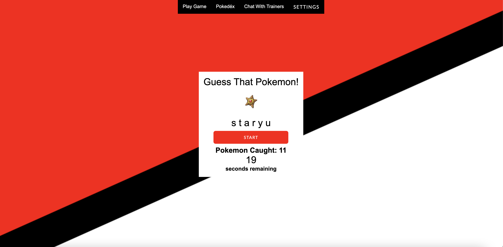
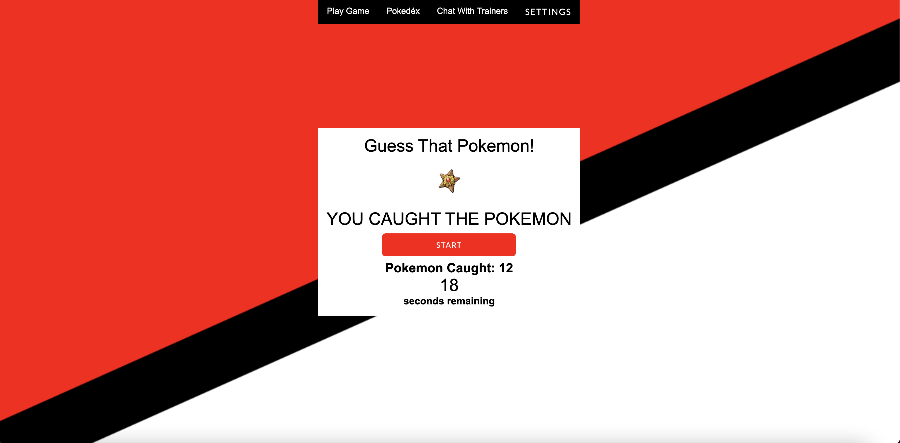

# Who's That Pokémon?


## Description:
Welcome to Who’s That Pokémon! Where you’re able to test your knowledge and embark on a journey to become a Pokémon master! Our project was to develop a Pokémon guessing game. Each user will have to login/signup, in order to play. When signed in, you’ll be taken to the menu page where you can do multiple things such as: Play Game, View Pokédex, Chat with Trainers, Update Password, and Log Out. To play the game, the user will be shown a picture of a Pokémon with 30 seconds to guess it’s name. If guessed correctly, the Pokémon will be “caught” and added to their Pokédex, where they can view the attributes of that specific Pokémon. Furthermore, the user can also go to a chat room to interact with other Pokémon trainers.  

## Motivation:
Motivation for this project was to bring back childhood memories with all the games on handheld devices.

## User Story:
As a Pokémon trainer, I want to be the very best, so that I can become the best that there ever was.

## Installation:

Clone the repository to your local development environment.

```
git clone git@github.com:anniechen9025/Whos-That-Pokemon.git
```

Run `npm install` in your terminal to install all dependencies. To run the application locally, run `node server.js` in your CLI, and then open `http://localhost:3001` in your preferred browswer. The Who's That Pokémon? app is [live on Heroku](https://whos-the-pokemon.herokuapp.com) for you to use as well.

## Deployed Link:
[Note Taker App](https://whos-the-pokemon.herokuapp.com)

[](https://whos-the-pokemon.herokuapp.com)

## Built With:
- [HTML5](https://html.com/html5/)
- [CSS](https://www.w3.org/Style/CSS/)
- [Javascript](https://www.javascript.com/)
- [Node.js](https://nodejs.org/en/)
- [Express.js](https://expressjs.com/)
- [MySQL2](https://www.npmjs.com/package/mysql2)
- [Sequelize](https://sequelize.org/)
- [Handlebars.js](https://handlebarsjs.com/)
- [Socket.io](https://socket.io/)
- [Pokémon API](https://pokeapi.co/)

## Example:






## Contributors:
Please feel free to contact any of the contributors through their GitHub to collaborate.
- [Li Hua Anderson](https://github.com/chopsushi206)
- [Jouan Chen](https://github.com/anniechen9025)
- [Daniel Phan](https://github.com/dannyphan6)
- [Christine Nguyen](https://github.com/ctinengyn)